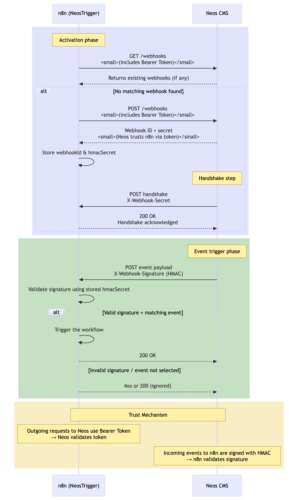
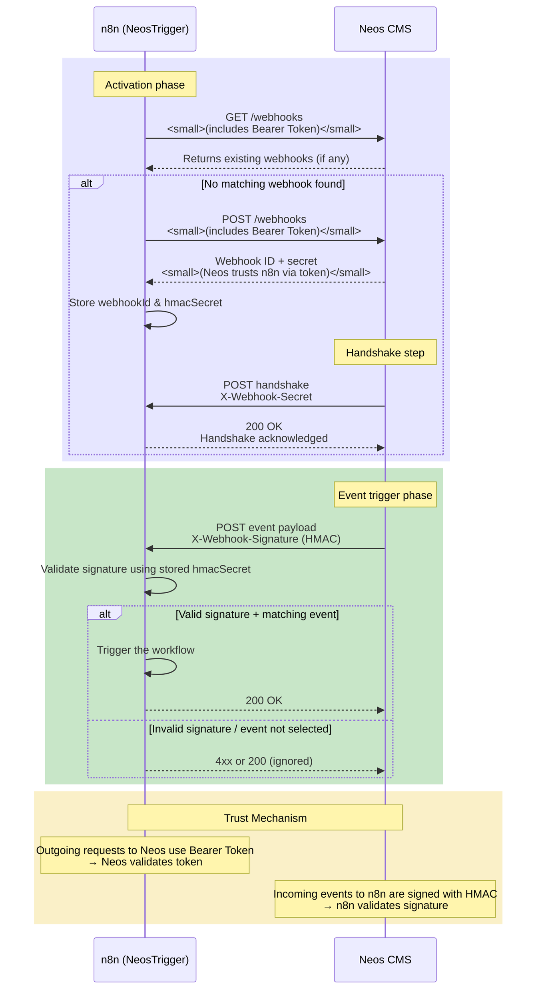

# WORK IN PROGSESS: n8n‑nodes‑neos

A community node that lets **n8n** react to events coming from your **Neos CMS**. Install the package, drop the node into any workflow, and automate everything that happens when editors publish, update, or remove content in Neos.

[Installation](#installation) · [Webhook setup in Neos](#webhook-setup-in-neos) · [Credentials in n8n](#credentials-in-n8n) · [Signal events & examples](#signal-events--examples) · [Screenshots](#screenshots) · [Resources](#resources) · [Version history](#version-history)

---

## Installation

1. **Self‑hosted n8n** – follow the official guide to [install community nodes](https://docs.n8n.io/integrations/community-nodes/installation/) in the n8n UI or via npm.
2. Search for `n8n-nodes-neos`, install it, then reload n8n; the **Neos CMS** Trigger and Action nodes will appear in the Node Picker.

> **Minimum n8n version:** 1.36.0 · **Node.js:** ≥ 20.15
> **Package**: `npm i n8n-nodes-neos`

---

## Credentials in n8n

1. **Generate an access token** in **Neos → Administration → API Tokens** (requires Neos v8+ or the REST API addon).
2. In n8n open **Settings → Credentials → New** and choose **“Neos CMS API”**.
3. Fill in:

   * **Neos Instance URL** – `https://your‑site.example` (optional but recommended so the node can build links).
   * **Access Token** – paste the token from Neos.
4. Click **Save**. The credential can now be selected in every Neos node.

---

## Signal events & examples

| Signal          | When it fires                                | Minimal JSON payload                                                                                           |
| --------------- | -------------------------------------------- | -------------------------------------------------------------------------------------------------------------- |
| `nodePublished` | Content is published to the *live* workspace | `{ "signalName": "nodePublished", "nodeIdentifier": "12345‑abc", "nodePath": "/sites/example/home" }`          |
| `nodeCreated`   | A new node is created in any workspace       | `{ "signalName": "nodeCreated", "nodeIdentifier": "98765‑xyz", "nodePath": "/sites/example/home/new-page" }`   |
| `nodeUpdated`   | An existing node is modified                 | `{ "signalName": "nodeUpdated", "nodeIdentifier": "abcde‑12345", "changedFields": ["title", "bodyText"] }`     |
| `nodeRemoved`   | A node is deleted                            | `{ "signalName": "nodeRemoved", "nodeIdentifier": "fghij‑67890", "nodePath": "/sites/example/home/old-page" }` |

Use an **IF** node in n8n to branch on `{{$json["signalName"]}}` and build separate flows per event.

---

## Screenshots

> **Notice**: Add your own screenshots to `docs/images/` and adjust filenames below.

---

## Resources

* **n8n Community Nodes documentation** – [https://docs.n8n.io/integrations/community-nodes/](https://docs.n8n.io/integrations/community-nodes/)
* **Neos CMS documentation** – [https://docs.neos.io/](https://docs.neos.io/)
* **n8n integrations index** – [https://docs.n8n.io/integrations/](https://docs.n8n.io/integrations/)
* **Package homepage** – [https://neosidekick.com/n8n-integration](https://neosidekick.com/n8n-integration) *(external)*

---

## Version history

| Version | Date       | Notes                                                               |
| ------- | ---------- | ------------------------------------------------------------------- |
| 0.1.0   | 2025‑05‑18 | Initial public release with webhook trigger and example action node |

---

## Architecture

---

## License

[MIT](./LICENSE.md)
